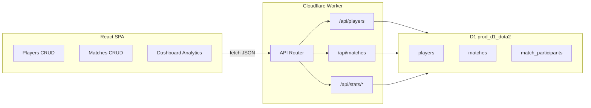

# Dota 2 In-House Tournament Winrate Tracker

## Current State

The repo is a deployable shell with no domain logic yet:

- Worker stub at [`worker/index.ts`](worker/index.ts) returns `{ name: "Cloudflare" }` for all `/api/*` routes
- D1 binding `prod_d1_dota2` is declared in [`wrangler.jsonc`](wrangler.jsonc) but unused
- Frontend is the Vite starter in [`src/App.tsx`](src/App.tsx) (also references missing `hero.png` — will be replaced)
- No migrations, schema, or routing

## Architecture



Three tabs in the SPA (no router dependency needed): **Dashboard**, **Players**, **Matches**. All writes go through the API; dashboard re-fetches stats after any mutation.

---

## 1. D1 Schema & Migration

Create [`migrations/0001_init.sql`](migrations/0001_init.sql):

```sql
CREATE TABLE players (
  id INTEGER PRIMARY KEY AUTOINCREMENT,
  name TEXT NOT NULL UNIQUE COLLATE NOCASE,
  created_at TEXT NOT NULL DEFAULT (datetime('now'))
);

CREATE TABLE matches (
  id INTEGER PRIMARY KEY AUTOINCREMENT,
  played_at TEXT NOT NULL,
  winner_side TEXT NOT NULL CHECK (winner_side IN ('radiant', 'dire')),
  created_at TEXT NOT NULL DEFAULT (datetime('now')),
  updated_at TEXT NOT NULL DEFAULT (datetime('now'))
);

CREATE TABLE match_participants (
  id INTEGER PRIMARY KEY AUTOINCREMENT,
  match_id INTEGER NOT NULL REFERENCES matches(id) ON DELETE CASCADE,
  player_id INTEGER NOT NULL REFERENCES players(id) ON DELETE RESTRICT,
  side TEXT NOT NULL CHECK (side IN ('radiant', 'dire')),
  hero TEXT NOT NULL,
  kills INTEGER NOT NULL DEFAULT 0 CHECK (kills >= 0),
  deaths INTEGER NOT NULL DEFAULT 0 CHECK (deaths >= 0),
  assists INTEGER NOT NULL DEFAULT 0 CHECK (assists >= 0),
  UNIQUE(match_id, player_id)
);
```

Add indexes on `match_participants(match_id)`, `match_participants(player_id)`, and `matches(played_at DESC)`.

Update [`wrangler.jsonc`](wrangler.jsonc) to add `"migrations_dir": "migrations"` on the D1 binding entry.

Add npm scripts:

- `db:migrate:local` — `wrangler d1 migrations apply prod-d1-dota2 --local`
- `db:migrate:remote` — `wrangler d1 migrations apply prod-d1-dota2 --remote`

Run `bun run cf-typegen` so `Env` includes `prod_d1_dota2: D1Database`.

---

## 2. Worker API

Refactor [`worker/index.ts`](worker/index.ts) into a small router that receives `(request, env)` and dispatches by method + path. Add shared helpers in `worker/lib/` for JSON responses and validation errors.

### Players — `/api/players`

| Method | Path | Behavior |
|--------|------|----------|
| GET | `/api/players` | List all, ordered by name |
| POST | `/api/players` | `{ name }` — trim, reject duplicates |
| PATCH | `/api/players/:id` | `{ name }` |
| DELETE | `/api/players/:id` | Block if player appears in any match (RESTRICT FK) |

### Matches — `/api/matches`

| Method | Path | Behavior |
|--------|------|----------|
| GET | `/api/matches` | List with summary (date, winner, participant count) |
| GET | `/api/matches/:id` | Full match + 10 participants |
| POST | `/api/matches` | Create match + participants in one D1 `batch()` |
| PATCH | `/api/matches/:id` | Update metadata + replace all participants atomically |
| DELETE | `/api/matches/:id` | Cascade deletes participants |

**Match payload shape:**

```typescript
{
  playedAt: "2026-07-04",
  winnerSide: "radiant" | "dire",
  radiant: [{ playerId, hero, kills, deaths, assists }, ...], // exactly 5
  dire:    [{ playerId, hero, kills, deaths, assists }, ...]  // exactly 5
}
```

Validation rules:
- Exactly 5 entries per side
- No duplicate `playerId` within the match (across both sides)
- All `playerId`s must exist
- Non-negative K/D/A

### Stats — `/api/stats/*`

| Endpoint | Returns |
|----------|---------|
| `GET /api/stats/cross-table` | `{ players: [{id, name}], cells: [{rowId, colId, wins, losses, games, winPct}] }` — only pairs with `games > 0`; symmetric pairs |
| `GET /api/stats/players` | Per-player: games, wins, losses, winPct, avgKills, avgDeaths, avgAssists, kda |
| `GET /api/stats/heroes` | Per hero (global): games, wins, winPct, avgKDA |
| `GET /api/stats/teammates` | Flat list of all teammate pairs: `{ playerA, playerB, wins, losses, games, winPct }` |

**Cross-table SQL core** (computed server-side):

```sql
-- For each pair on the same side in the same match
SELECT p1.player_id AS row_id, p2.player_id AS col_id,
       COUNT(DISTINCT p1.match_id) AS games,
       SUM(CASE WHEN p1.side = m.winner_side THEN 1 ELSE 0 END) AS wins
FROM match_participants p1
JOIN match_participants p2
  ON p1.match_id = p2.match_id AND p1.side = p2.side AND p1.player_id != p2.player_id
JOIN matches m ON m.id = p1.match_id
GROUP BY p1.player_id, p2.player_id
```

Post-process: `losses = games - wins`, `winPct = wins / games`. Diagonal cells are omitted (frontend renders gray empty cells).

---

## 3. Frontend

Replace starter UI with a tabbed layout in [`src/App.tsx`](src/App.tsx). Add shared types in [`src/types.ts`](src/types.ts) and a thin [`src/api/client.ts`](src/api/client.ts) wrapper around `fetch`.

### Tab: Players

- Table listing all players (name, total games, win rate — from stats endpoint or inline count)
- Inline add form + edit/delete actions
- Delete shows API error if player has match history

### Tab: Matches

- Sortable match list (date, winner side, quick score summary)
- **Add/Edit form** with two columns (Radiant / Dire), 5 rows each:
  - Player dropdown (from players list)
  - Hero text input
  - K / D / A number inputs
- Date input + winner-side selector (Radiant / Dire)
- Delete with confirmation

### Tab: Dashboard (primary analytics view)

Per your preference: **full N×N matrix for all players** (no "focus player" selector).

**A. Cross-table matrix** ([`src/components/CrossTable.tsx`](src/components/CrossTable.tsx))

Mirrors the tournament image you shared:
- Row/column headers = player names
- Diagonal = dark gray, empty
- Off-diagonal cells = `W-L` + win % (e.g. `5W-3L · 63%`)
- Background color scales green (high win%) → red (low win%) based on winPct
- Cells with no shared games = neutral/muted
- Horizontally scrollable on mobile

**B. Sortable analytics tables** (reusable [`src/components/SortableTable.tsx`](src/components/SortableTable.tsx))

Click column headers to sort asc/desc:

| Table | Columns | Default sort |
|-------|---------|--------------|
| Player leaderboard | Name, Games, W-L, Win%, Avg K/D/A, KDA | Win% desc |
| Teammate pairs | Player A, Player B, Games, W-L, Win% | Win% desc |
| Hero stats | Hero, Games, W-L, Win%, Avg KDA | Games desc |

**C. Summary stat cards** at top

- Total matches played
- Most games played (player)
- Best hero by win% (min 2 games)
- Highest win-rate player (min 3 games)

### Styling

Extend existing CSS variables in [`src/index.css`](src/index.css) — dark-theme friendly, Dota-inspired accent colors (radiant green `#3d9970`, dire red `#c0392b`), responsive grid layout. Remove broken `hero.png` import.

### Data freshness

After any player or match CRUD action, invalidate and re-fetch dashboard stats so the matrix and tables always reflect latest input.

---

## 4. Key Files to Create/Modify

| File | Purpose |
|------|---------|
| [`migrations/0001_init.sql`](migrations/0001_init.sql) | Schema |
| [`wrangler.jsonc`](wrangler.jsonc) | Add `migrations_dir` |
| [`worker/index.ts`](worker/index.ts) | Router entry |
| `worker/routes/players.ts` | Player CRUD |
| `worker/routes/matches.ts` | Match CRUD |
| `worker/routes/stats.ts` | Analytics queries |
| `worker/lib/validation.ts` | Shared validators |
| [`src/App.tsx`](src/App.tsx) | Tab shell |
| `src/pages/DashboardPage.tsx` | Cross-table + analytics |
| `src/pages/PlayersPage.tsx` | Player CRUD |
| `src/pages/MatchesPage.tsx` | Match CRUD |
| `src/components/CrossTable.tsx` | Matrix visualization |
| `src/components/SortableTable.tsx` | Reusable sortable table |
| `src/api/client.ts` | Typed fetch helpers |
| [`package.json`](package.json) | Add `db:migrate:*` scripts |

No new UI framework dependencies — plain React + CSS keeps the diff focused.

---

## 5. Implementation Order

1. Schema migration + apply to remote D1 + regenerate types
2. Worker API (players → matches → stats) with validation
3. Frontend API client + Players tab (establishes data entry flow)
4. Matches tab (complex form)
5. Dashboard cross-table + sortable analytics tables
6. Polish: error states, empty states, responsive scroll, lint pass

---

## 6. Verification

- Add 8+ players, enter several matches with overlapping teammates
- Confirm cross-table cells show correct symmetric W-L / % and color coding
- Edit a match → dashboard updates
- Delete a match → stats recalculate
- Attempt delete player with matches → blocked with clear message
- Sort each analytics table by different columns
- `bun run build` succeeds; `bun run dev` shows live updates against remote D1
